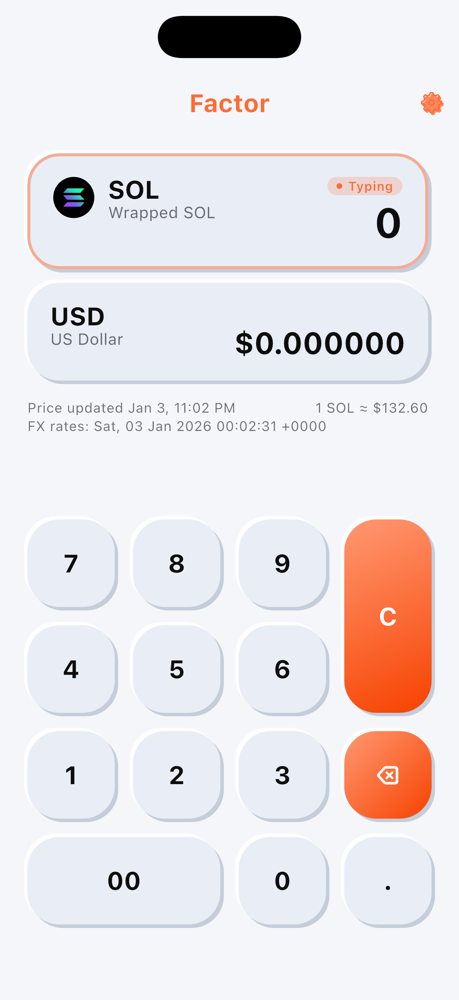

# Factor

A minimal crypto-to-fiat exchange rate calculator powered by Jupiter (Solana) and CoinGecko data. Built with Flutter 3.8.

  

## Features

- Live token pricing with Jupiter Lite + CoinGecko fiat rates
- Clean dark UI with quick keypad input and dynamic formatting
- 50+ fiat currencies and token list from assets/json/crypto.json
- Works offline for recent values; errors surfaced via BotToast

## Quick start

1. Install Flutter 3.8.x and run `flutter pub get`.
2. Start the app: `flutter run` (Android/iOS).
3. Optional: update app icon and splash via `flutter_launcher_icons` and `flutter_native_splash` configs.

## Useful links

- License: <https://website-tawny-five-47.vercel.app/license>
- Privacy Policy: <https://website-tawny-five-47.vercel.app/privacy-policy>
- Copyright: <https://website-tawny-five-47.vercel.app/copyright>

## Tests

- `flutter test` (widget scaffold currently minimal)
